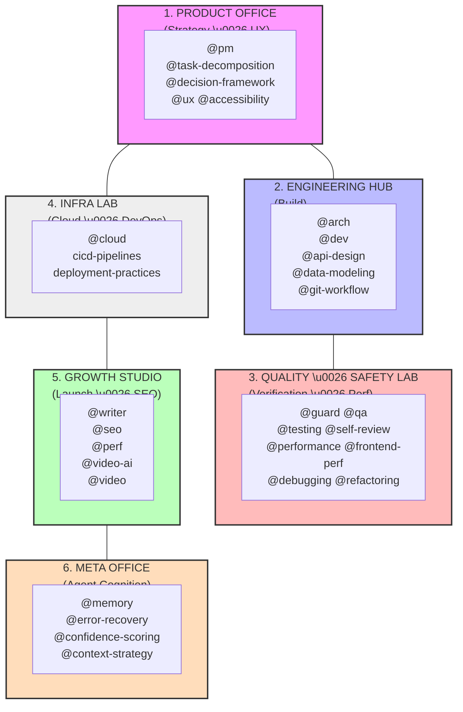

# The Virtual Product Factory

**Build at the Speed of Decision.**

The Virtual Product Factory is an autonomous product engineering department in a box. It transforms raw requirements into launched products by grounding agents in a rigorous, role-simulated lifecycle.

---

## 🏗️ Departmental Overview
*One glance at the Factory's capabilities.*



---

## ⚡ The Operational Engine
*How to drive the Factory from Start to Finish.*

The Factory operates as a **closed-loop system**. Every prompt initiates a workflow that doesn't end until a **Baton of State** (Artifact) is verified and committed.

### 1. The Fuzzy Start (Ideation ➔ Grounding)
- **Primary Department**: Product Office
- **Trigger**: "I have a new idea, but I'm not sure where to start."
- **Workflow**: `Clarify Intent` ➔ `Scope Brief` ➔ `Acceptance Criteria`.
- **The Result**: A `spec.md` file that defines exactly what "Done" looks like.
- **Agent Prompt**: *"Initiate **Fuzzy Start**. Using `@pm` and `@ux`, transform this idea into a grounded `spec.md` with binary acceptance criteria."*

### 2. Architectural Rigor (Blueprint ➔ Implementation)
- **Primary Department**: Engineering Hub + Quality Lab
- **Trigger**: "I have a spec and I'm ready to build it."
- **Workflow**: `Implementation Plan` ➔ `TDD Cycle` ➔ `Self-Review`.
- **The Result**: Working code that passes all `getDiagnostics` and local tests.
- **Agent Prompt**: *"Initiate **Architectural Rigor**. Use `@arch` to design the system, then `@dev` to implement it. Ensure `@self-review` is run before handoff."*

### 3. The Security Sentry (Audit ➔ Approval)
- **Primary Department**: Quality & Safety Lab
- **Trigger**: "The code is written, I need to ensure it's safe to merge."
- **Workflow**: `Security Audit` ➔ `Convention Check` ➔ `Drift Detection`.
- **The Result**: A `risk-report.md` or a "Pass" score in the pull request.
- **Agent Prompt**: *"Run the **Security Sentry**. Have `@guard` review the latest diffs for convention drift and security vulnerabilities."*

### 4. The Growth Engine (Launch ➔ SEO)
- **Primary Department**: Growth Studio
- **Trigger**: "The feature is verified. Let's tell the world."
- **Workflow**: `Technical Audit` ➔ `SEO Strategy` ➔ `Content Generation`.
- **The Result**: Meta tags implemented + Launch blog/newsletter drafted.
- **Agent Prompt**: *"Trigger the **Growth Engine**. Use `@seo` to optimize the new routes and `@writer` to draft the release notes and a 'Why we built this' article."*

### 5. The Deploy Loop (Verification ➔ Live)
- **Primary Department**: Infra Lab
- **Trigger**: "Everything is approved. Deploy to staging/production."
- **Workflow**: `CI/CD Trigger` ➔ `Smoke Test` ➔ `Infrastructure Sync`.
- **The Result**: A live URL + "Deployment Successful" status.
- **Agent Prompt**: *"Execute the **Deploy Loop**. Follow the `deployment-practices` to sync infra changes and verify the build on staging."*

---

## 🤝 The Handoff Protocol

Each transition between departments is powered by a **Handoff Artifact**.

| Handoff | The "Baton" (Artifact) | Explicit Output |
| :--- | :--- | :--- |
| **Product ➔ Arch** | `spec.md` | Scoped features + Acceptance criteria. |
| **Arch ➔ Dev** | `tech-spec.md` | Model schemas + Service boundaries. |
| **Dev ➔ Guard** | `implementation.diff` | Working code + Verification proof. |
| **Guard ➔ QA** | `risk-report.md` | Audited code + Performance metrics. |

---

## 🦾 Integration & Onboarding

### 1. Production Method: Git Submodule (Recommended)
Add the factory as a submodule for project-specific version control.

```bash
git submodule add https://github.com/vshrinath/virtual-product-factory.git .vpf
git submodule update --init --recursive
```

### 2. Quick Start: Curl
Use the setup script for rapid prototyping or global utility.

```bash
curl -sSL https://raw.githubusercontent.com/vshrinath/virtual-product-factory/main/setup.sh | bash
```

---

## 🗺️ Navigation
- **[AGENTS.md](AGENTS.md)**: The full operational manual and rules.
- **[CONVENTIONS.md](CONVENTIONS.md)**: Your project's unique "Source of Truth."
- **[INDEX.md](INDEX.md)**: Technical reference of all 28+ skills.

---

MIT License • 2026 The Virtual Product Factory
