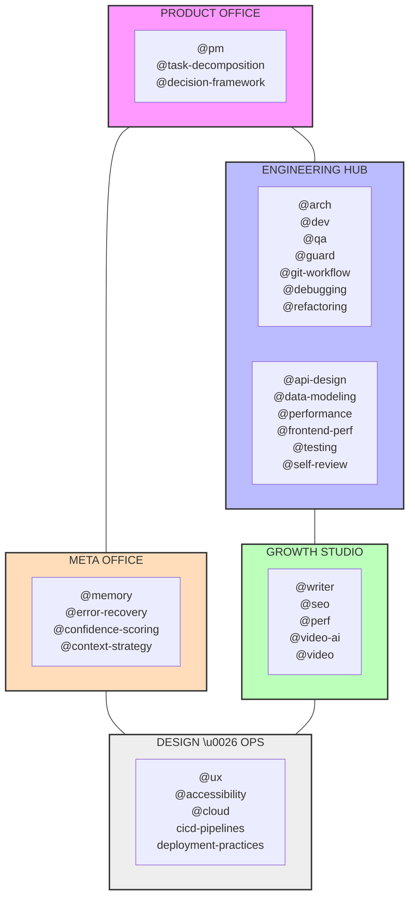
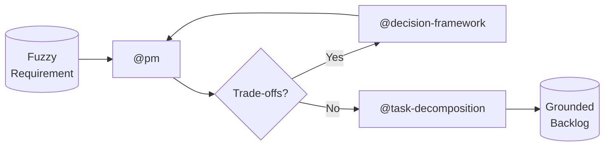
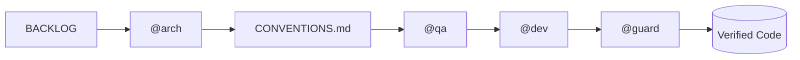
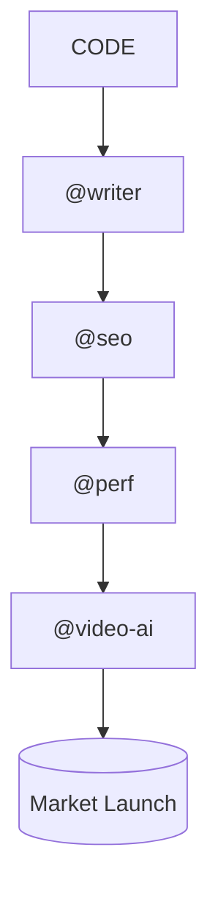

# The Virtual Product Factory

**Build at the Speed of Decision.**

The Virtual Product Factory is an autonomous product engineering department in a box. It transforms raw requirements into launched products by grounding agents in a rigorous, role-simulated lifecycle.

---

## ❓ What are Skills?

Skills are high-signal markdown files that provide AI agents (Cursor, Windsurf, Claude, etc.) with **specialized knowledge, expert workflows, and guardrails**.

Standard LLMs are generalists. Adding these skills to your project workspace transforms them into **specialists** who:
- **Simulate Roles**: They act as PMs, Architects, or SEO experts based on the task.
- **Enforce Rigor**: They follow established best practices (TDD, safety reviews, decomposition).
- **Maintain Context**: They know *how* to build within the boundaries of your **CONVENTIONS.md**.

---

## 🏗️ Departmental Overview
*One glance at the Factory's capabilities.*



---

## ⚡ Operational Playbooks (The Flow)

How the Factory moves from ideation to launch.

### 1. The Fuzzy Start (Ideation ➔ Backlog)
The **Product Office** grounds loose requirements into a structured backlog using `@pm` and `@task-decomposition`.



### 2. Architectural Rigor (Blueprint ➔ TDD)
The **Engineering Hub** architects the solution (`@arch`), creates a test plan (`@qa`), and builds via TDD (`@dev`).



### 3. The Growth Engine (Code ➔ Market)
The **Growth Studio** handles the transition from "code complete" to "market ready" via `@writer`, `@seo`, and marketing assets.



---

## 🦾 Integration & Onboarding

### 1. Production Method: Git Submodule (Recommended)
Add the factory as a submodule for project-specific version control and easy updates.

```bash
# Add the factory to your project
git submodule add https://github.com/vshrinath/virtual-product-factory.git .vpf
git submodule update --init --recursive
```

### 2. Quick Start: Curl
Use the setup script for rapid prototyping or global utility.

```bash
curl -sSL https://raw.githubusercontent.com/vshrinath/virtual-product-factory/main/setup.sh | bash
```

### 🛠️ How `setup.sh` Works
The script **symlinks** the factory's canonical rules into your agent's configuration:
- **Cursor**: Symlinks to `.cursorrules`.
- **Windsurf**: Symlinks to `.windsurfrules`.
- **General**: Connects any agent to your **AGENTS.md** steering layer.

---

## 🗺️ Navigation
- **[CONVENTIONS.md](CONVENTIONS.md)**: Your project's unique "Source of Truth."
- **[AGENTS.md](AGENTS.md)**: The principles and handoff rules for your factory.
- **[INDEX.md](INDEX.md)**: A complete technical reference of all 28+ skills.
- **[CHANGELOG.md](CHANGELOG.md)**: Record of factory updates and improvements.

---

MIT License • 2026 The Virtual Product Factory
