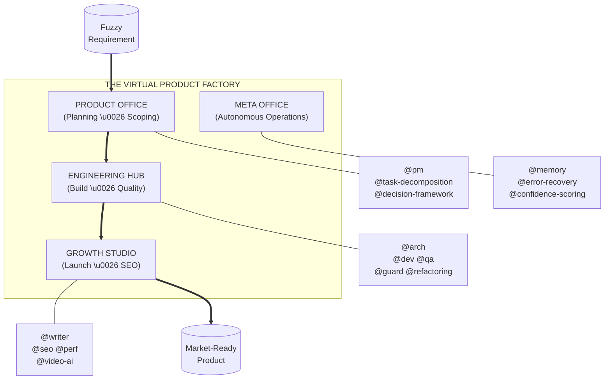

# The Virtual Product Factory

**Build at the Speed of Decision.**

The Virtual Product Factory is an autonomous product engineering department in a box. It transforms raw requirements into launched products by grounding agents in a rigorous, role-simulated lifecycle.

---

## ❓ What are Skills?

Skills are high-signal markdown files that provide AI agents (Cursor, Windsurf, Claude, etc.) with **specialized knowledge, expert workflows, and guardrails**.

Standard LLMs are generalists. Adding these skills to your project workspace transforms them into **specialists** who:
- **Simulate Roles**: They act as PMs, Architects, or SEO experts based on the task.
- **Enforce Rigor**: They follow established best practices (TDD, safety reviews, decomposition).
- **Maintain Context**: They know *how* to build within the boundaries of your **CONVENTIONS.md**.

---

## 🏗️ The Factory Overview

The Factory is organized into specialized "Departments." Each department coordinates a set of autonomous skills to move your product through the value chain.



---

## ⚡ Operational Playbooks

The Factory uses three primary playbooks to manage the product lifecycle.

### 1. The Fuzzy Start (Ideation ➔ Backlog)
*Handles: Vague requests and feature "asks."*
The **Product Office** analyzes the goal, handles technical trade-offs via `@decision-framework`, and decomposes the request into a list of atomic, testable tasks.

### 2. Architectural Rigor (Blueprint ➔ TDD)
*Handles: New features and system upgrades.*
The **Engineering Hub** creates a technical blueprint (`@arch`), establishes a test plan (`@qa`), and then builds via TDD (`@dev`). A final safety review (`@guard`) ensures zero convention drift.

### 3. The Growth Engine (Code ➔ Market)
*Handles: Content marketing and SEO.*
The **Growth Studio** handles the transition from "code complete" to "market ready." It generates SEO-grounded copy (`@writer`, `@seo`) and marketing assets (`@perf`, `@video-ai`).

---

## 🦾 Integration & Onboarding

There are two primary ways to bring the Virtual Product Factory into your workflow.

### 1. Production Method: Git Submodule (Recommended)
For long-term project stability, add the factory as a submodule. This ensures your agents always have access to the latest skills while maintaining version control.

```bash
# Add the factory to your project
git submodule add https://github.com/vshrinath/virtual-product-factory.git .vpf
git submodule update --init --recursive
```

### 2. Quick Start: Curl
Use the setup script for one-off tasks or rapid prototyping.

```bash
curl -sSL https://raw.githubusercontent.com/vshrinath/virtual-product-factory/main/setup.sh | bash
```

### 🛠️ How `setup.sh` Works
The setup script detects your environment and **symlinks** the relevant skill files into your agent-specific configuration paths:
- **Cursor**: Symlinks to `.cursorrules` or `.cursor/rules/`.
- **Windsurf**: Symlinks to `.windsurfrules`.
- **General**: Creates global grounding for Claude Code and other agents.

---

## 🗺️ Navigation
- **[CONVENTIONS.md](CONVENTIONS.md)**: Your project's unique "Source of Truth."
- **[AGENTS.md](AGENTS.md)**: The principles and handoff rules for your factory.
- **[INDEX.md](INDEX.md)**: A complete technical reference of all 28+ skills.

---

MIT License • 2026 The Virtual Product Factory
